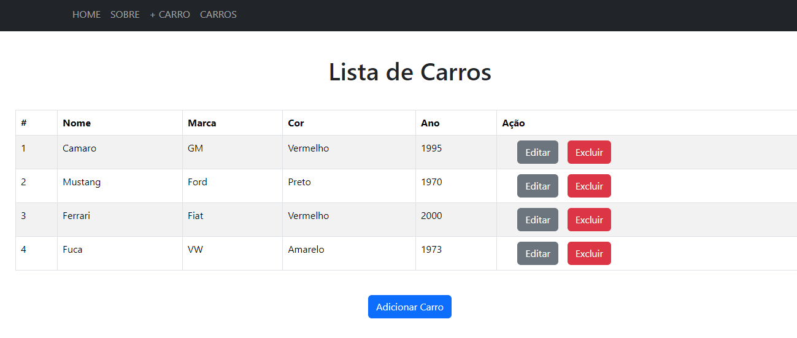
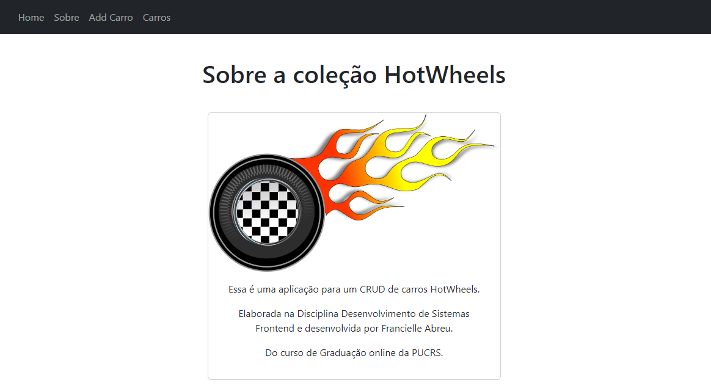
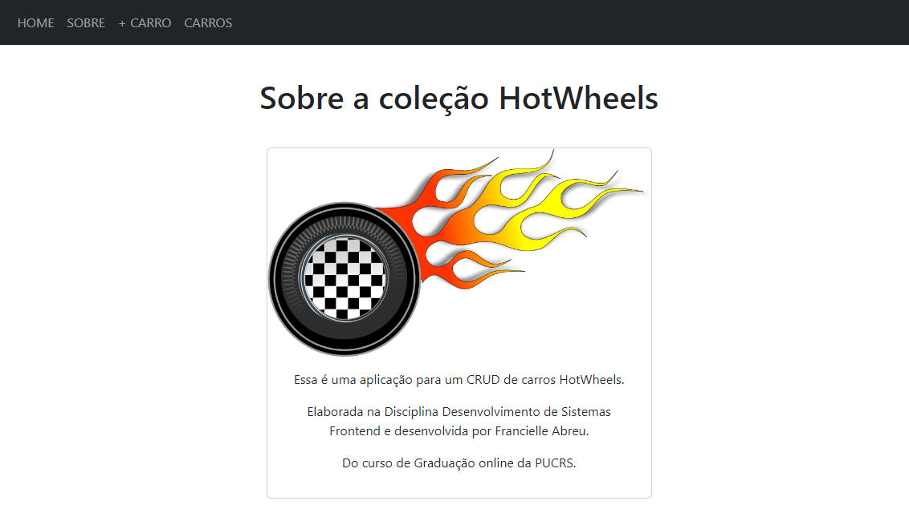
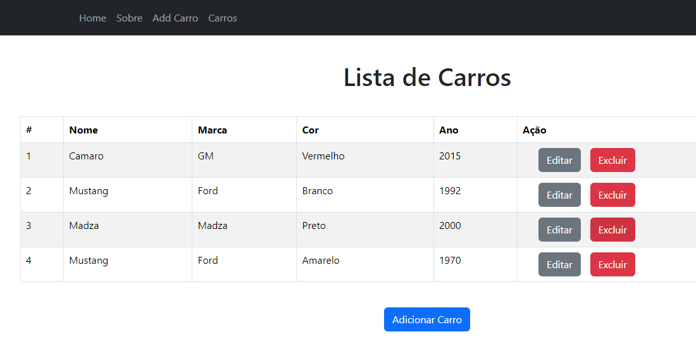
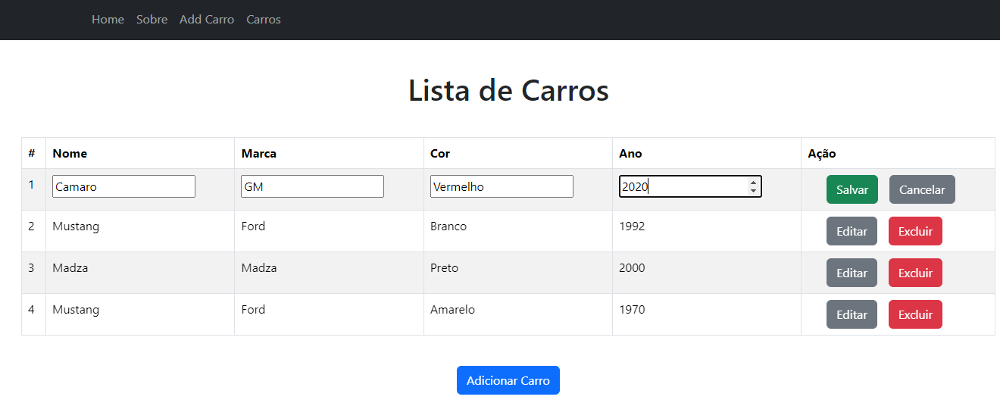

## Nome: `Francielle Abreu`

Para executar este projeto:

1. Entre pasta hotwheels-crud no terminal:
```
cd hotwheels-crud
```

2. Rode npm install para instalar as dependências do projeto:
```
npm install
```

3. E em seguida, npm start, para iniciar a execução do projeto.
```
npm start
```

Após execução do projeto, este é o resultado esperado no navegador:

Sobre:

Adicionar carro:

Lista de Carros:

Lista de Carros:


## Introdução

Este projeto contém uma estrutura básica a partir do template CRA com o objetivo de demostrar como compartilhar o estado de uma aplicação utilizando React Router.

## Componentes e Páginas

Os componentes estão no diretório `./src/components` e foram organizados da seguinte forma:
 possuem as seguintes características:
- CarForm: componente responsável por renderizar um formulário que permite ao usuário adicionar informações sobre um carro. 
- CarList: componente responsável por listar os carros adicionados no compornente CarForm.
- Navbar: este componente utiliza Link do React Router para mostrar as páginas disponíveis em uma barra de navegação.

As páginas estão no diretório `./src/pages` e foram organizados da seguinte forma:
 possuem as seguintes características:
- Home: página inicial da aplicação, que dá boas-vindas aos usuários.
- About: fornece informações sobre a aplicação, incluindo seu propósito, bem como outras informações relevantes.
- AddCar: contém o formulário de adição de carros (`CarForm`). É onde os usuários podem inserir novas entradas de carros na aplicação. A página `AddCar` centraliza o formulário e fornece um cabeçalho claro indicando a funcionalidade de adicionar um carro.
- Cars: esta página exibe a lista de carros que foram adicionados (`CarList`). Utiliza dados armazenados no `localStorage` para manter a persistência dos dados entre as sessões do navegador. Cada carro é listado com suas informações (nome, marca, cor e ano).

## Conclusão

Este projeto é apenas para fins demonstrativos e não contém mais alterações do que as necessárias para demostrar algumas funcionalidades úteis para o desenvolvimento de projetos em ReactJS.