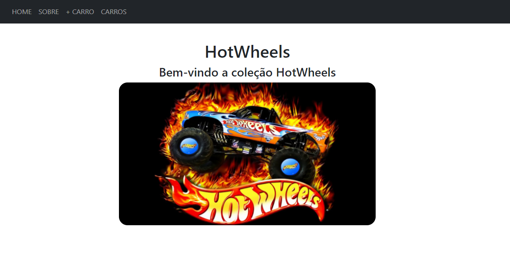
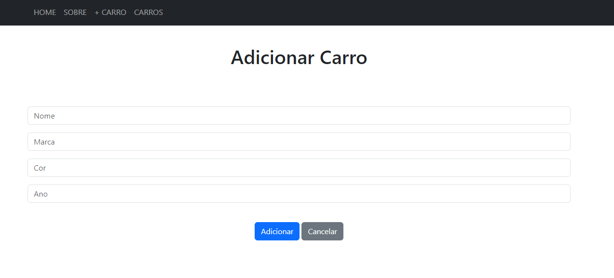

## Nome: `Francielle Abreu`

Para executar este projeto:

1. Entre pasta hotwheels-crud no terminal:
```
cd hotwheels-crud
```

2. Rode npm install para instalar as dependências do projeto:
```
npm install
```

3. E em seguida, npm start, para iniciar a execução do projeto.
```
npm start
```

Após execução do projeto, este é o resultado esperado no navegador:

Home:

Sobre:

Adicionar carro:

Lista de Carros:

Lista de Carros:

## Introdução

Este projeto contém uma estrutura básica a partir do template CRA (Create React App) com o objetivo de demonstrar como compartilhar o estado de uma aplicação utilizando React Router.

## Componentes e Páginas

Os componentes estão no diretório ./src/components e possuem as seguintes características:

Os componentes estão no diretório `./src/components` e foram organizados da seguinte forma:

- CarForm: componente responsável por renderizar um formulário que permite ao usuário adicionar informações sobre um carro. 
- CarList: componente responsável por listar os carros adicionados no compornente CarForm.
- Navbar: este componente utiliza Link do React Router para mostrar as páginas disponíveis em uma barra de navegação.

As páginas estão no diretório `./src/pages` e foram organizados da seguinte forma:

- Home: página inicial da aplicação, que dá boas-vindas aos usuários.
- About: fornece informações sobre a aplicação, incluindo seu propósito, bem como outras informações relevantes.
- AddCar: contém o formulário de adição de carros (`CarForm`). É onde os usuários podem inserir novas entradas de carros na aplicação. A página `AddCar` centraliza o formulário e fornece um cabeçalho claro indicando a funcionalidade de adicionar um carro.
- Cars: esta página exibe a lista de carros que foram adicionados (`CarList`).

## Funcionalidades Adicionais

- Implementar Rotas: utiliza a biblioteca de roteamento React Router para navegação entre páginas;
- Estilização e Componentização: utilizado React Bootstrap para estilização e componentização;
- Consumo da API REST: a API REST fornecida é consumida pelo projeto React frontend, explorando a biblioteca Axios para realizar requisições HTTP e consumir dados da API.
- Funcionalidades Dinâmicas: foi implementado funcionalidades dinâmicas como listagem, busca, criação, edição e exclusão de dados utilizando os dados provenientes da API.
- Testes Funcionais: foi implementado testes funcionais nos componentes para garantir que todas as funcionalidades estão funcionando conforme esperado.

## Conclusão

Este projeto é apenas para fins demonstrativos e contém funcionalidades úteis para o desenvolvimento de projetos em ReactJS, incluindo navegação, estilização, consumo de APIs, manipulação de dados e testes.